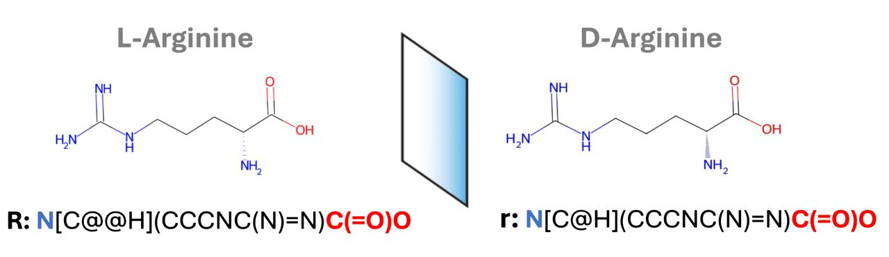
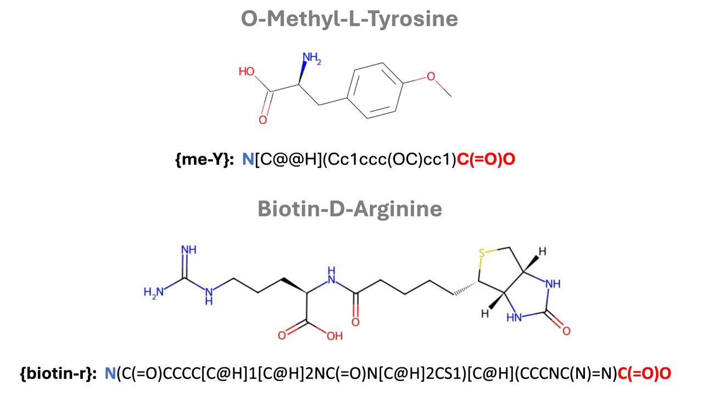

# Smiles2Peptides

## Installation Guide

Follow the steps below to set up the environment and install the required dependencies for using `smiles2peptides`.

### 1. Create a Conda Environment

```sh
conda create --name smiles2peptides python=3.7.16
```

### 2. Activate the Environment

```sh
conda activate smiles2peptides
```

### 3. Install Dependencies

```sh
conda install conda-forge/label/cf202003::rdkit
```
```sh
conda install anaconda::pandas
```
```sh
conda install anaconda::ipykernel
```
```sh
conda install anaconda::openpyxl
```

### 4. Install `smiles2peptides`

```sh
pip install git+https://github.com/danielgarzonotero/smiles2peptides.git
```

## Usage

Once installed, you can import and use the library in your Python scripts:

```python
from smiles2peptides.main import generating_rdkit_mol

"""
Generates an RDKit molecule from a sequence using the amino acid dictionary.
    
    Parameters:
        sequence (str): The amino acid sequence or components.
        show_display (bool): If True, displays the generated molecule image.
    
    Returns:
        Chem.Mol: An RDKit molecule representing the full sequence
"""

mol = generating_rdkit_mol(sequence="DaN{biotin}G{me-T}{a-N3}", show_display=True)
```
### Peptide Notation

- **L-chirality amino acids** are denoted in **UPPERCASE**.

- **D-chirality amino acids** are denoted in **lowercase**.



- **Non-natural amino acids** are enclosed in `{Xyz}`.
- **Modifications** such as acetylation and amidation are also enclosed in `{}`, e.g., `{ac}` for acetylation and `{am}` for amidation.

For a full list of supported amino acids, refer to **`amino_acid_library.xlsx`**.

## Author

[Daniel Garzón Otero](https://github.com/danielgarzonotero)
